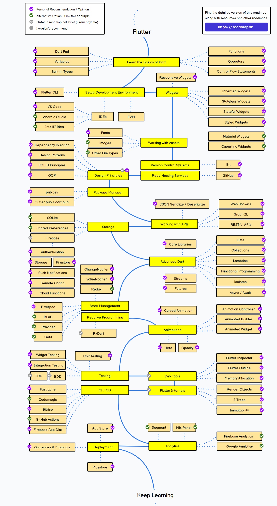
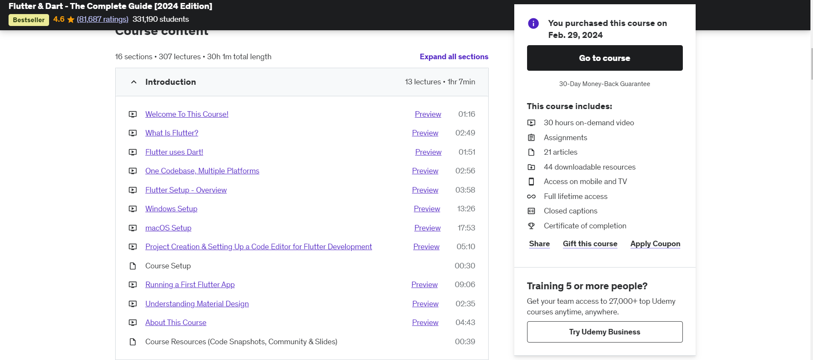

# App Development Roadmap

**Note:** If you already have an understanding of programming fundamentals and core development concepts, you can skip to [Step 6: Frameworks](##Step6). 

---

## Step 1: Learn Programming Concepts

#### 1) Understand the working and usage of commonly used data structures like lists, dictionaries(maps), tuples, arrays, sets etc.

#### 2) Learn Object Oriented Programming Concepts like classes functions, objects etc.

***Resources***:
- https://www.w3schools.com/
- https://www.geeksforgeeks.org/   (More detailed)

***You will have cleared Step 1 if you completely learn any one Object Oriented Programming Language(Python, Java, Dart)***

## Step 2: Understanding How the Internet Works

### 1) Learn Basic Networking Concepts
- HTTP/HTTPS, DNS, IP addresses, client-server model.

### 2) Understand APIs
- RESTful APIs, making requests (GET, POST, PUT, DELETE), JSON.

### 3) Understand Frontend-Backend (Client/Server) Interaction
- Data flow between servers and clients.

### 4) Understand Security Basics
- Encryption, authentication, secure communication.

**Resources**:
  - [MDN Web Docs: HTTP Overview](https://developer.mozilla.org/en-US/docs/Web/HTTP/Overview)
  - [How the Internet Works](https://howtheinternet.works)

---

## Step 3: Understanding Databases

 - **Core Concepts**:
  - What is a database?  
  - Difference between relational (SQL) and non-relational (NoSQL) databases.
  - CRUD operations: Create, Read, Update, Delete.
- **SQL Basics**:
  - Learn queries for relational databases like MySQL or PostgreSQL:
    - SELECT, INSERT, UPDATE, DELETE
    - JOINs and basic subqueries
- **NoSQL Basics**:
  - Explore NoSQL databases like Firebase Firestore or MongoDB.
  - Understand collections and documents.
- **Resources**:
  - SQL: [W3Schools SQL Tutorial](https://www.w3schools.com/sql/)
  - Firebase: [Firebase Documentation](https://firebase.google.com/docs)

***For Step 2 and 3 you don't have to be thorough you just need to have an idea of how things work***

## Step 4: Understanding Frameworks

### 1) Learn About Frameworks 
- Understand what frameworks are and how they simplify development. 
- You can explore different backend and frontend frameworks
### 2) Native Development
- **iOS Development**: Use Swift or Objective-C and tools like XCode.
- **Android Development**: Use Kotlin or Java and Android Studio.
- Native development allows you to create apps optimized for specific platforms with full access to device features.
### 3) Cross-Platform Development
- **Flutter (Dart)**: Google’s framework for building natively compiled apps for mobile, web, and desktop from a single codebase.
- **React Native (JavaScript)**: Create apps with native performance using JavaScript.
- **Xamarin (C#)**: A Microsoft framework for creating cross-platform apps with .NET.
- **Ionic (JavaScript)**: Leverages web technologies to build hybrid apps.
### 4) Pros and Cons
- Native apps provide high performance and better platform-specific capabilities.
- Cross-platform apps save development time and cost by reusing code for multiple platforms.

***Resources***:
- [Flutter Documentation](https://flutter.dev/docs) 
- [Flutter Udemy Course](https://www.udemy.com/course/learn-flutter-dart-to-build-ios-android-apps/?couponCode=NVDIN35)
- [React Native Guide](https://reactnative.dev/docs/getting-started)

## Step 5: Learn version control
- Learn how to use Git and GitHub

**Resources**:
  - [ Git Tutorial for Dummies ](https://www.youtube.com/watch?v=mJ-qvsxPHpY&t=72s&ab_channel=NickWhite) (20 min long YouTube video)
  - [Pro Git Book](https://git-scm.com/book/en/v2) (Some book)

### Step6

***Once you have the basics down you can start learning App Development Frameworks***

### Flutter Roadmap

- I took the above roadmap from https://roadmap.sh/flutter (You can also find roadmaps for other things there)
 
### Flutter Setup

**Visit Flutter's official Documentation for all and any information related to Flutter**
- [Flutter Official Docs](https://flutter.dev/docs)

**Flutter Installation**
 -  Visit the [installation guide](https://flutter.dev/docs/get-started/install) for platform-specific instructions (Windows, macOS, Linux).
 -  After selecting your platform you will be asked to select your first type of App. Select Android
 -  Follow the instructions there to set up Flutter

**Flutter Installation(Alternative):**
- Go to this Udemy Course  [Flutter Course](https://www.udemy.com/course/learn-flutter-dart-to-build-ios-android-apps/?couponCode=NVDIN35)(Click this link)
- Scroll down and click on Windows Setup or MacOS setup

- Follow the video instructions

***Tip: The videos in the introduction module are free so you can watch them to get a basic idea of Flutter as well as setup your environment for Flutter*** 
(and the same is true for most Udemy Courses)

**P.S**:  I'm not promoting Udemy or anything; this just happens to be the course I took to learn Flutter, and it's really nice.

